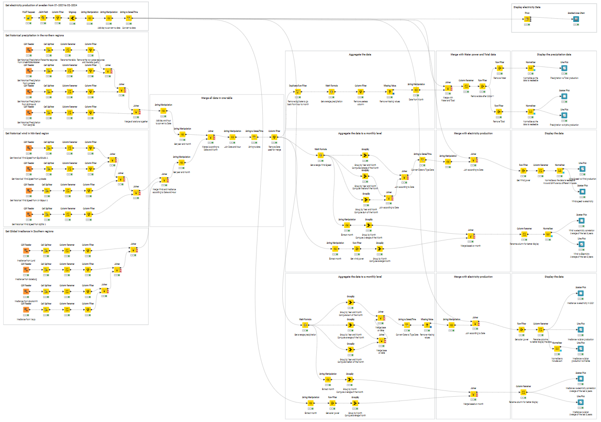
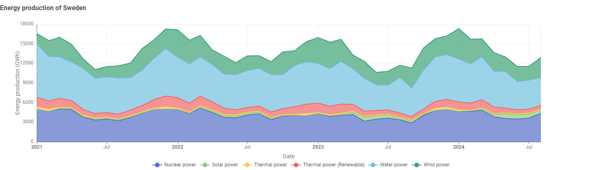
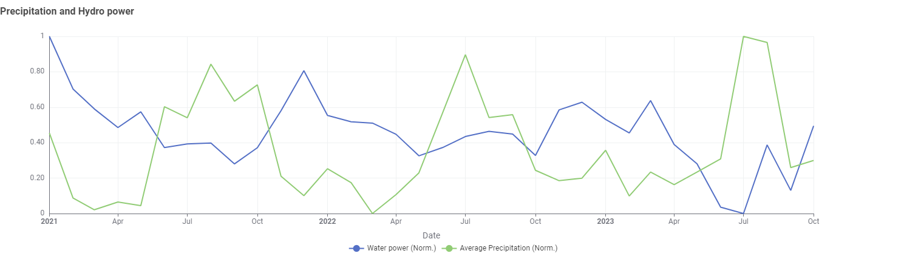
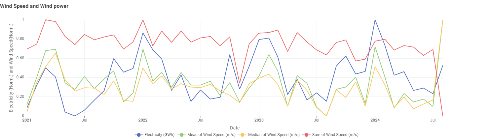
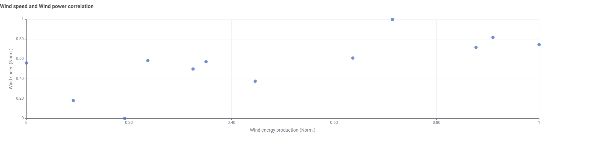
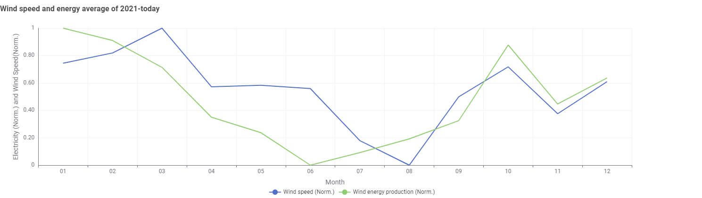
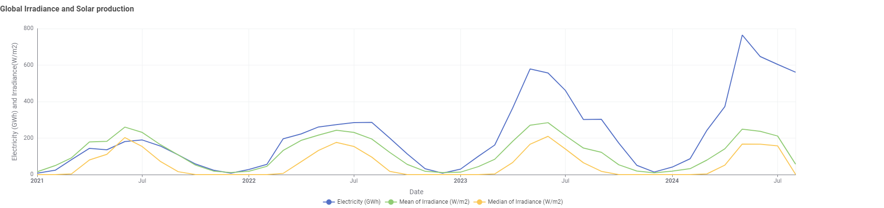
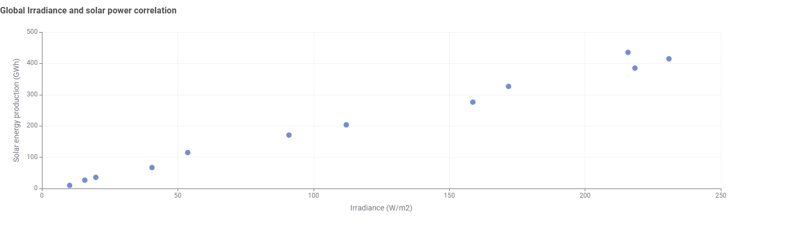
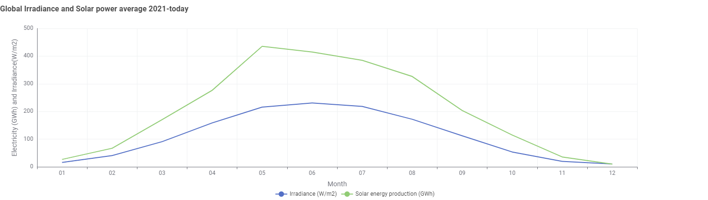

# Renewable Energy and Weather Correlation Analysis

This project investigates correlations between weather factors and renewable energy production in Sweden, focusing on wind, solar, and hydroelectric power. We examine how weather variables like wind speed, solar irradiance, and precipitation relate to renewable power outputs.

## Requirements

To explore this project, you can either:

- **Fork this repository** and open it as a workspace in [KNIME](https://www.knime.com/).
- **Download `SCB_Power_Production.knwf`** and import the workflow into KNIME.

## Project Overview

The workflow examines three key relationships:

- **Wind Speed vs. Wind Power**: Assessing how variations in wind speed affect wind power production.
- **Global Irradiance vs. Solar Power**: Exploring the impact of sunlight on solar power generation.
- **Precipitation vs. Water Power**: Analyzing precipitation’s influence on hydroelectric power output.

## Workflow Structure

The workflow in KNIME is annotated and includes comments to guide you through each step. Here's an overview of the process:

## Key Findings

### 1. Sweden's Energy Production Over Time

A stacked chart provides insights into how Sweden’s electricity production evolves over time, showing water as the primary source, especially in winter when electricity production rises to meet higher demand.

### 2. Precipitation and Hydro Power

We began with precipitation and water power production. Surprisingly, there’s no clear correlation, likely because Sweden stores water in reservoirs during summer when rainfall is higher, releasing it in winter to meet energy needs.

### 3. Wind Speed and Wind Power

Next, we analyzed wind speed and wind power production. Here, we found a notable correlation. To confirm, we created a scatter plot using data from 2021 onwards, removing outliers to clarify the trend. Although the correlation isn’t perfect, a general relationship is visible.

### 4. Global Irradiance and Solar Power

Finally, we investigated global irradiance and solar power production, revealing a clear correlation. Sweden is rapidly expanding its solar energy capacity, as confirmed by a scatter plot highlighting this strong relationship.

